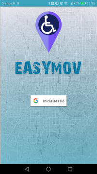
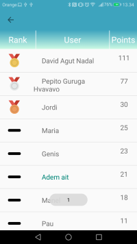
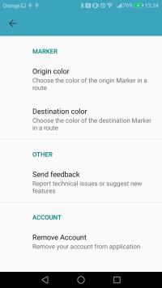

# EasyMoveFront
Android App made with [Android Studio](https://developer.android.com/studio).
It has the propose of helping handicapped people by showing all markpoints where it is an obstacle.

## Screenshots

### Login page
Login with google using OAuth

### Home page
Map using Google Maps API

There are two icons:
- Left one: create a route

- Right one: create an obstacle

There are obstacles with the app logo interface. When pressed:

There is a like and resolve button(to notificate when an obstacle has been removed, i.e. now there is an elevator)

### Menu

### Profile page

### Ranking page
Puntuation works as:
+ Create an obstacle 10 points
+ For every like/dislike on your obstacle 1 point/-1 point.

### Settings page

## Authors
Agut Nadal, David

Ait Fonollà, Adem

Cases, Jordi
